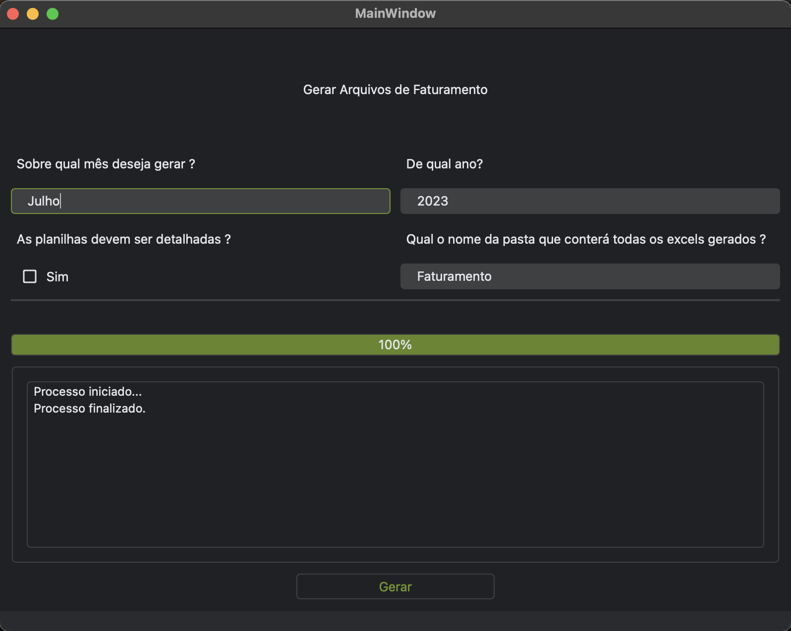

# Projeto de Faturamento de Exames Médicos
Este projeto tem como objetivo calcular o faturamento de exames médicos realizados por uma empresa médica e gerar relatórios detalhados em arquivos .xlsx.

## Pré-requisitos

Antes de começar, certifique-se de ter os seguintes softwares instalados:

- Python 3.7 ou superior
- pip (gerenciador de pacotes do Python)

## Instalação

1. Clone o repositório:

    ```sh
    git clone https://github.com/Matheussop/ScriptSomer.git
    cd ScriptSomer
    ```

2. Crie um ambiente virtual e ative-o:

    ```sh
    python -m venv venv
    source venv/bin/activate  # Linux/Mac
    venv\Scripts\activate  # Windows
    ```

3. Instale as dependências:

    ```sh
    pip install -r requirements.txt
    ```

## Uso

1. Coloque os arquivos de entrada (ValoresEmpresas.xlsx e examesRealizados.xlsx) na pasta `files`.

2. Caso não queira utilizar a interface gráfica apenas execute o script principal (faturamento.py) com os parâmetros necessários:

    ```sh
    python faturamento.py --year 2024 --month Maio --folder saida --detail
    ```

    - `--year`: O ano do faturamento.
    - `--month`: O mês do faturamento.
    - `--folder`: A pasta onde os arquivos gerados serão salvos.
    - `--detail`: Gera relatórios detalhados se esta opção for fornecida.

## Configuração

### Estrutura dos Arquivos

- `files/ValoresEmpresas.xlsx`: Contém os valores de cada exame separado por empresa.
- `files/examesRealizados.xlsx`: Contém os dados dos exames realizados no mês.

### Estrutura do Arquivo ValoresEmpresas.xlsx

| Exame       | Valor |
|-------------|-------|
| Exame A     | 100   |
| Exame B     | 200   |

### Estrutura do Arquivo examesRealizados.xlsx

| Data       | Empresa          | Funcionário  | Função    | Exames      | Tipo de Exame |
|------------|------------------|--------------|-----------|-------------|---------------|
| 2024-05-01 | Empresa Exemplo  | Matheus Luiz | Analista  | Exame A/B   | Tipo 1        |


# Link com detalhes do projeto

Todos os detalhes de construção do projeto se encontra neste [link](https://nervous-drawbridge-3d4.notion.site/Script-de-Faturamento-e37311c49a41486aa69eb554a4d611ee?pvs=4)

Tela: 


## Contribuição

1. Faça um fork do projeto.
2. Crie uma branch para sua feature (`git checkout -b feature/nova-feature`).
3. Commit suas mudanças (`git commit -am 'Adiciona nova feature'`).
4. Faça o push para a branch (`git push origin feature/nova-feature`).
5. Abra um Pull Request.

## Licença

Este projeto está licenciado sob a Licença MIT - veja o arquivo [LICENSE](LICENSE) para mais detalhes.

## Contato

Nome do Desenvolvedor - [matheussopluiz@outlook.com](mailto:matheussopluiz@outlook.com)
